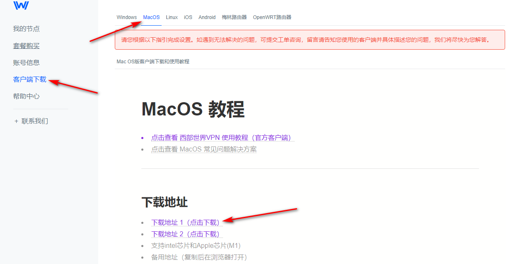
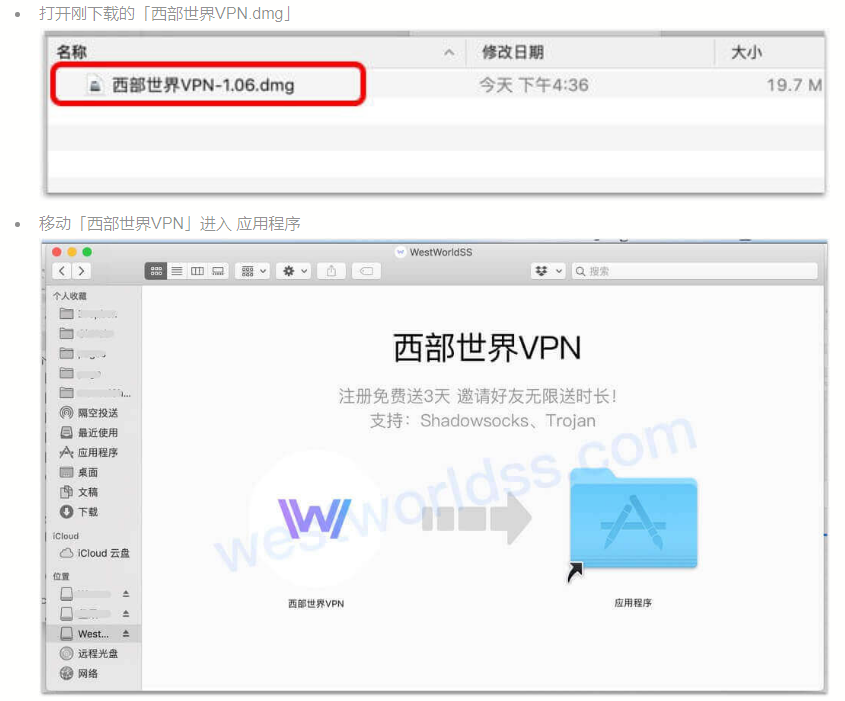
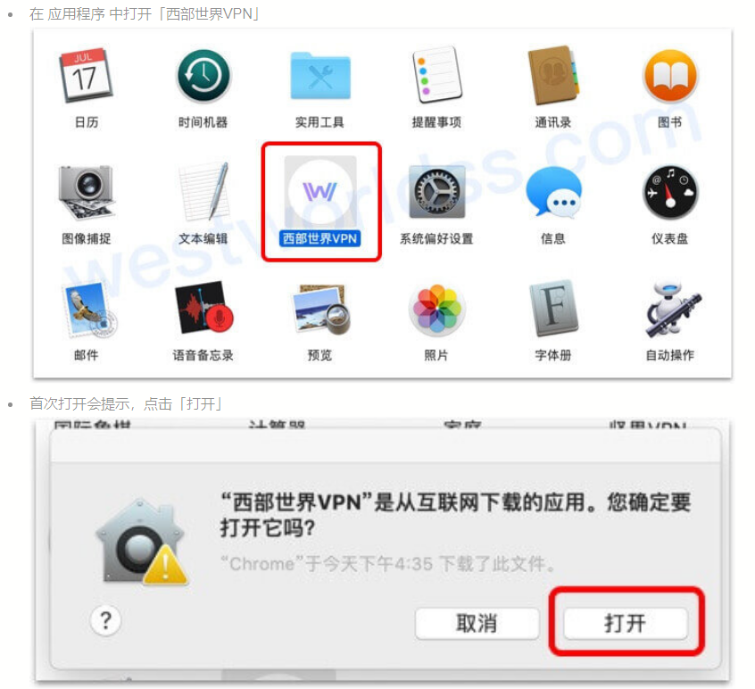
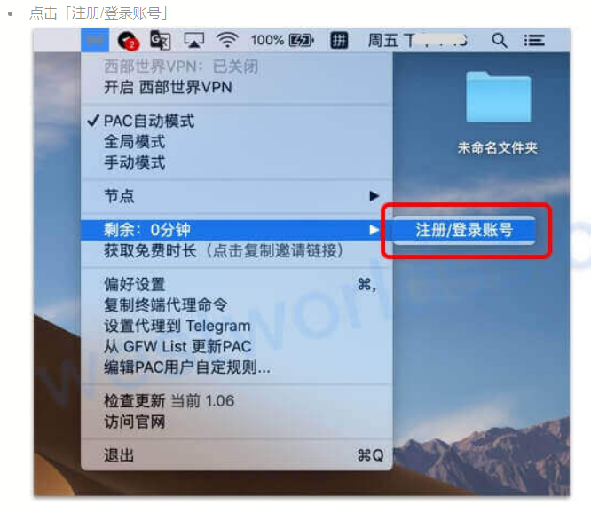
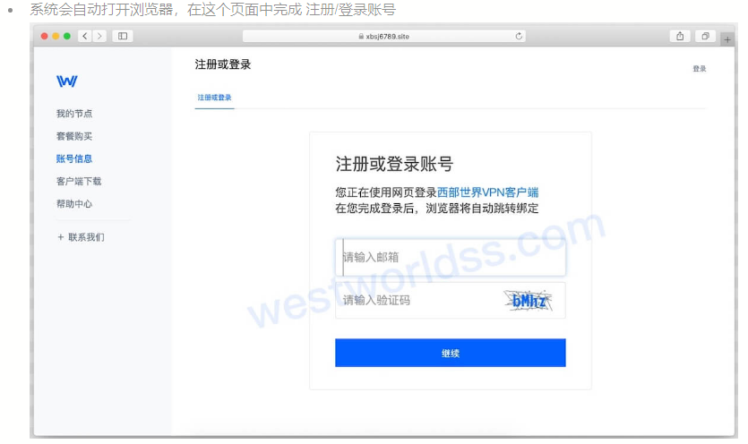

# Mac苹果电脑免费梯子VPN推荐，翻墙科学上外网详细教程
Mac苹果电脑梯子,苹果挂梯子怎么弄,苹果什么梯子好用,mac电脑怎么挂梯子上外网,mac梯子推荐,苹果端梯子,mac好用的翻墙,免费mac电脑梯子

目前当下，适用于windows电脑的**免费梯子软件**有很多，但是能完美适配**Mac苹果电脑的免费翻墙梯子**却不多，更别说要兼具稳定好用的特性，今天给大家介绍的这个Mac苹果电脑梯子，就是我这段时间一直在用的。

**首先肯定是要先注册一个免费的梯子账号，官网链接如下：[https://xbsj4621.fun/i/art028](https://xbsj4621.fun/i/art028)**

注册阶段的邮箱链接可以填写真实邮箱，也可以填写随意虚构的邮箱，看个人意愿，反正都能注册成功。

然后就是在官网的客户端下载界面，下载网站上的macos苹果电脑客户端。

这里是下载安装包，下载成功之后，直接在电脑上安装Macos 梯子就行，安装截图如下：

安装成功之后，就可以直接在电脑文件夹中，打开这个pc梯子的客户端。

打开之后，在mac苹果电脑右上方的工具栏，会出现一个‘W’字样的客户端图标，鼠标右键单击这个图标，在出现的选项中，选择账号登录。

这时候，会自动在浏览器中跳出一个网页版登陆界面，在网页版登录界面当中输入账号密码，然后登陆。

登录之后，在出现的弹窗上，单击允许，就能完成客户端的账号登录。

然后选择节点，连接就能使用。

这个**Mac苹果电脑梯子**的安装和使用过程还是很简单的，但是登录后，你会发现后台除了免费节点之外，还有付费节点，接下来给大家介绍下，怎么长期免费使用这个苹果电脑梯子。

首先在注册阶段，大家会发现，如果用虚构的邮箱注册，免费使用时间只有六小时，但是用真实邮箱注册，在接收了验证码验证后，免费使用时间会长达三天。

这时候，用网上免费接码邮箱，去接收验证码即可。

这类接码邮箱生成网站有很多，只要在百度或者谷歌中搜索关键词“免费邮箱”，就能出现一大堆的网站，随便挑选一个就行，将网站当中生成的邮箱，填入网站上然后注册，这样的话，只要十几秒，就能注册一个免费三天的账号，到期后重复这一步操作就行。

### 相关问题：

### Macos苹果电脑梯子软件显示连接成功，但依旧无法翻墙怎么办？

请您检查是否安装过其他代理工具或者浏览器插件
如您使用了其他代理工具，或者「Unblock Youku」这类和代理有关的浏览器插件，请您先关闭，否则会影响翻墙。您也可以换其他浏览器尝试一下，看是否能够翻墙。

### 如果我想用这个免费的苹果电脑梯子软件访问Telegram该如何设置？

1、在客户端上点击 设置代理到 Telegram
2、系统将自动为您设置 Telegram 代理

### 软件上的各类代理模式应该如何选择？

一般情况下，使用PAC模式即可；如遇某些网站无法访问，则可以开启全局模式。
如果暂时不需要翻墙，可以开启直连模式，或者直接关闭代理客户端。

PAC自动模式：根据访问的网站来判断是否走代理，即国内网站不翻墙，国外网站翻墙。

全局模式：所有网站均走代理，即全部翻墙。

手动模式：所有网站均不走代理，即不翻墙。走代理的软件需要单独在相应的客户端中修改代理设置，适合有特殊需求的用户。

**这款免费mac苹果电脑梯子软件，总体而言，不管从速度还是稳定性来说，我都十分推荐，能够解锁Netflix等流媒体，并且观看Youtube视频默认的清晰度也是1080P，总之白嫖一时爽，一直白嫖一直爽。**
